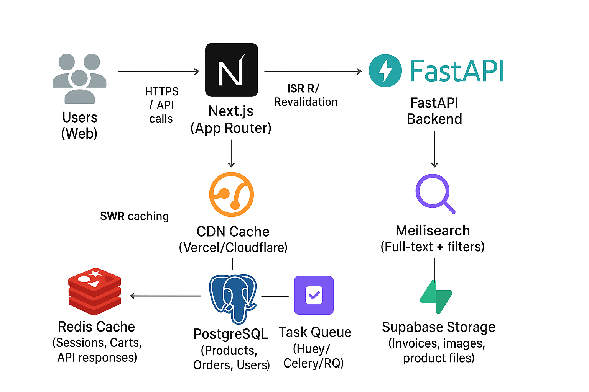

# Shop

Shop is an e-commerce platform that leverages modern web technologies to provide a seamless shopping experience. This project uses Next.js for the frontend and FastAPI for the backend.

## 🏗️ Architecture



## Features

- Responsive web design
- Real-time product updates
- User authentication and authorization
- Shopping cart functionality
- Order management
- Payment integration (paystack)

## Tech Stack

### Frontend
- [Next.js](https://nextjs.org/) - React framework for production
- [React](https://reactjs.org/) - JavaScript library for building user interfaces
- Tailwindcss
- React-aria

### Backend
- [FastAPI](https://fastapi.tiangolo.com/) - Modern, fast (high-performance) Python web framework
- (PostgreSQL, supabase)
- Redis for caching
- Meillisearch

## Getting Started

### Prerequisites

- Node.js (version 18 or higher)
- Python (version 3.11 or higher)
- (Any other prerequisites)

### Installation

1. Clone the repository
   ```
   git clone https://github.com/teebarg/botcommerce.git
   cd botcommerce
   ```

2. Set up the frontend
   ```
   cd frontend
   npm install
   ```

3. Set up the backend
   ```
   cd ../backend
   pip install -r requirements.txt
   ```

4. Set up environment variables
   - Create a `.env` file in both the frontend and backend directories
   - Add necessary environment variables (e.g., API keys, database URLs)

5. Set up Supabase Storage Buckets
   - Create the following buckets in your Supabase project:
     - `images` - for general images
     - `exports` - for exported files
     - `invoices` - for invoice PDFs
   - Ensure all buckets have public access enabled for file downloads

### Running the Application

1. Start the backend server
   ```
   cd backend
   uvicorn main:app --reload
   ```

2. In a new terminal, start the frontend development server
   ```
   cd frontend
   npm run dev
   ```

3. Open your browser and navigate to `http://localhost:3000`

## Contributing

We welcome contributions to Shop! Please see our [Contributing Guide](CONTRIBUTING.md) for more details.

## License

This project is licensed under the [MIT License](LICENSE).

## Contact

For any inquiries, please reach out to [teebarg01@gmail.com](mailto:teebarg01@gmail.com).

