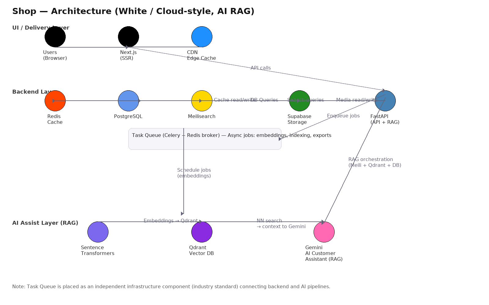

# BotCommerce

BotCommerce is an e-commerce platform with:

- **Frontend**: **TanStack Start** app in `app/` (React 19, TanStack Router/Query, Vite)
- **Backend**: **FastAPI** service in `backend/` (PostgreSQL, Redis cache, Meilisearch search)
- **Worker**: **Celery** tasks in `worker/` (async jobs: indexing, notifications, embeddings, exports)

This repo previously had a different storefront; the active storefront is **TanStack Start in `app/`**.

---

## Architecture (high level)



- **HTTP API**: FastAPI serves under **`/api/*`** (config: `backend/app/core/config.py` → `API_V1_STR="/api"`).
- **Search**: Meilisearch is used for fast catalog queries and faceting.
- **Cache/session**: Redis for caching, carts/sessions, and as the Celery broker.
- **DB**: PostgreSQL is the system of record.
- **Optional services**: Qdrant / vector search are present in code but not enabled in the default `docker-compose.yml`.

---

## Repo layout

```
botcommerce/
├── app/                # TanStack Start storefront (the frontend)
├── backend/             # FastAPI API service
├── worker/              # Celery worker (optional in local dev)
├── docker-compose.yml   # Dev infra (traefik, postgres, redis, meilisearch, backend)
├── Makefile             # Common dev commands
└── README.md
```

---

## Quickstart (local dev)

### Prerequisites

- Node.js 18+
- pnpm
- Python 3.11+
- uv (`https://github.com/astral-sh/uv`)
- Postgres + Redis + Meilisearch (or use Docker Compose below)

### Install

Frontend:

```sh
cd app
pnpm install
```

Backend:

```sh
cd backend
uv sync
```

Worker (optional):

```sh
cd worker
uv sync
```

### Configure env

There are no committed `.env.example` files in this repo. Create these locally:

#### `app/.env`

- **`API_URL`**: base URL of the backend (default in code is `http://localhost.dev`, so set this)
  - Local backend: `API_URL=http://localhost:8000`
  - Docker backend via Traefik: `API_URL=http://api.localhost:7000` (see Docker section)
- (Optional) **`VITE_BASE_URL`**, **`VITE_WS`**, **`VITE_CONTACT_EMAIL`**, **`VITE_VAPID_PUBLIC_KEY`**: used in a few UI features and share links.

#### `backend/.env`

Minimum you’ll usually want:

- `DATABASE_URL=postgresql://...`
- `REDIS_URL=redis://...`
- `MEILI_HOST=http://...`
- `MEILI_MASTER_KEY=...`
- `FRONTEND_HOST=http://localhost:5173` (important: backend CORS allowlist uses this)

### Run

From repo root, if you have `make`:

```sh
make dev
```

If you don’t have `make` (common on Windows), run in two terminals:

```sh
cd backend
uvicorn app.main:app --reload --host 0.0.0.0 --port 8000
```

```sh
cd app
pnpm dev
```

Optional worker:

```sh
cd worker
celery -A celery_app.celery_app worker -l info
```

### URLs

- Frontend: `http://localhost:5173`
- Backend: `http://localhost:8000`
- Backend docs: `http://localhost:8000/api/docs`

---

## Quickstart (Docker Compose)

`docker-compose.yml` is primarily for infra + backend. The `app` container is currently **commented out**.

Start dev stack:

```sh
make up
```

Useful endpoints (from compose ports):

- Traefik dashboard: `http://localhost:7001` (router host: `http://traefik.localhost`)
- Backend (direct port): `http://localhost:7002`
- Backend (via Traefik host rule): `http://api.localhost:7000`
- Meilisearch: `http://localhost:7005` (or `http://meilisearch.localhost:7000`)
- Adminer: `http://localhost:7006` (or `http://adminer.localhost:7000`)
- Redis: `localhost:7007`
- RedisInsight: `http://localhost:7008` (or `http://redisinsight.localhost:7000`)
- Postgres: `localhost:7004`

Then run the frontend locally:

```sh
cd app
pnpm dev
```

and set `app/.env`:

```
API_URL=http://api.localhost:7000
```

---

## API surface (major route groups)

The API is under `/api/*` and is composed of routers in `backend/app/api/routes/`.

Common paths:

- `/api/auth/*`
- `/api/product/*`
- `/api/category/*` (includes `/api/category/home/products`)
- `/api/collection/*`
- `/api/cart/*`
- `/api/order/*`
- `/api/payment/*`
- `/api/users/*`
- `/api/chat/*`
- `/api/reviews/*`
- `/api/coupon/*`

---

## Developer ergonomics

### Make targets

- `make dev`: run backend + app (uses `uvicorn` + `pnpm dev`)
- `make serve-backend`: backend only
- `make serve-app`: app only
- `make lint-backend`, `make test-backend`: backend quality gates
- `make up`, `make stop`, `make logs service=backend`: docker compose helpers

### Conventions

- Frontend server calls use TanStack Start `createServerFn` (see `app/src/server/*`).
- API client base URL is configured by `process.env.API_URL` (see `app/src/utils/fetch-api.ts`).

---

## Troubleshooting

- **CORS errors**: set `FRONTEND_HOST=http://localhost:5173` in backend env; restart backend.
- **Frontend can’t reach backend**: ensure `app/.env` sets `API_URL` to the backend base URL.
- **Meilisearch auth failures**: confirm `MEILI_MASTER_KEY` matches the container (compose uses `"secret"` by default).

---

## License

MIT — see `LICENSE`.

